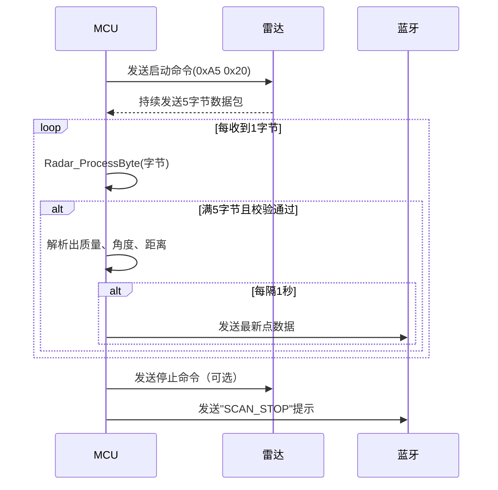

# 雷达模块工作原理说明（密实模式DenseBoost）

## 1. 模块简介

本雷达模块通过串口（UART）与主控板通信，使用密实模式(DenseBoost)进行高速扫描，实时接收雷达扫描数据，并通过蓝牙串口将处理后的数据发送到上位机或手机。主要功能包括雷达初始化、密实模式启动/停止扫描、84字节数据包解析和数据转发。

---

## 2. 数据流与主要流程

1. **初始化**  
   调用 `Radar_Init`，传入雷达串口和蓝牙串口句柄，完成句柄保存。

2. **启动扫描**  
   调用 `AX_LASER_Start`，向雷达发送EXPRESS_SCAN命令（A5 82 05 01 00 00 00 00 22），启动密实模式。随后开启串口中断接收。

3. **数据接收与解析**  
   每收到一个字节，调用 `HAL_UART_RxCpltCallback`，将字节填入200字节缓存。  
   - 当缓存满200字节或每100ms时，调用 `DenseMode_DataHandle` 进行密实模式数据处理
   - 系统自动识别84字节密实模式数据包，验证同步标志和校验和
   - 解析40个Cabin结构，计算每个点的角度和距离

4. **数据转发**  
   每隔1秒，通过蓝牙串口发送一次最新的点数据，格式为：  
   ```
   质量,角度,距离\r\n
   ```

5. **停止扫描**  
   调用 `AX_LASER_Stop`，停止数据接收，并通过蓝牙提示"SCAN_STOP"。

---

## 3. 密实模式数据包格式说明

密实模式使用84字节数据包，格式如下：

### 3.1 数据包结构
| 字节偏移 | 字段名 | 大小 | 说明 |
|---------|--------|------|------|
| 0 | sync1 | 1字节 | 同步标志1 (0x0A) |
| 1 | sync2 | 1字节 | 同步标志2 (0x05) |
| 2 | chksum[3:0] | 4位 | 校验和低4位 |
| 3 | chksum[7:4] | 4位 | 校验和高4位 |
| 4 | start_angle_q6[7:0] | 1字节 | 起始角度低8位 |
| 5 | S + start_angle_q6[14:8] | 1字节 | S标志 + 起始角度高7位 |
| 6-85 | cabin[0-39] | 80字节 | 40个Cabin结构 |

### 3.2 Cabin结构
每个Cabin为2字节，包含：
- **distance[15:0]**：距离数据（单位：mm）

### 3.3 角度计算
- **起始角度**：start_angle_q6 / 64.0（度）
- **Cabin角度**：start_angle + (angle_diff / 40) * cabin_index
- **角度差值**：连续数据包间的角度差，处理360度跨越

### 3.4 校验和计算
校验和 = XOR(字节2到字节83)，用于验证数据包完整性

---

## 4. 密实模式优势

1. **高速采样**：提供最快的测距采样频率
2. **高精度**：使用Q6格式角度，精度更高
3. **数据完整性**：84字节数据包包含40个测距点
4. **同步机制**：S标志用于数据包同步和错误恢复
5. **角度插值**：自动计算每个Cabin的精确角度

---

## 5. 函数说明

### 5.1 主要函数
- `AX_LASER_Start()`：启动密实模式扫描
- `AX_LASER_Stop()`：停止扫描
- `DenseMode_DataHandle()`：密实模式数据处理入口
- `DenseMode_ValidatePacket()`：数据包验证
- `DenseMode_ParsePacket()`：数据包解析

### 5.2 数据处理流程
1. 接收数据 → 2. 缓冲区管理 → 3. 数据包验证 → 4. 数据解析 → 5. 角度计算 → 6. 数据存储

---

## 4. 主要函数说明

- `Radar_Init(UART_HandleTypeDef* huart_radar, UART_HandleTypeDef* huart_bt)`  
  初始化雷达和蓝牙串口。

- `Radar_StartScan(void)`  
  启动雷达扫描，发送启动命令，开启数据接收。

- `Radar_StopScan(void)`  
  停止雷达扫描，关闭数据接收。

- `Radar_ProcessByte(uint8_t byte)`  
  处理每个接收到的字节，组包、校验、解析数据，并定时通过蓝牙发送最新点。

---

## 5. 工作时序图



---

## 6. 典型应用场景

- 移动机器人避障与定位
- 环境建图与测距
- 智能小车雷达传感

---

如需进一步了解代码细节，请参考 `radar.c` 文件中的详细注释。 